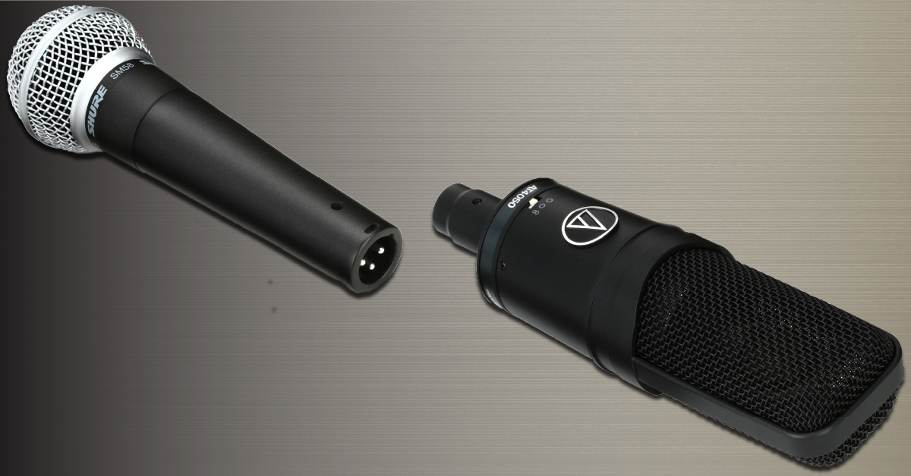
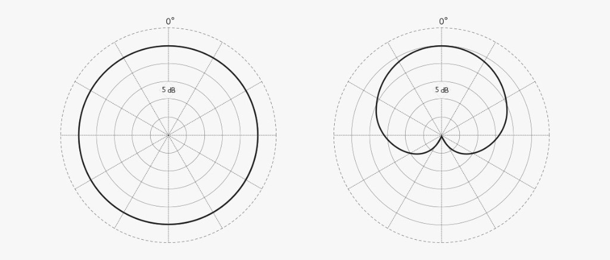
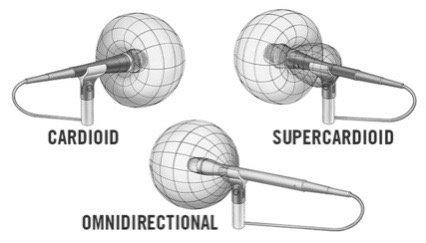
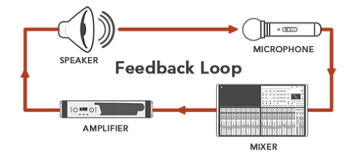
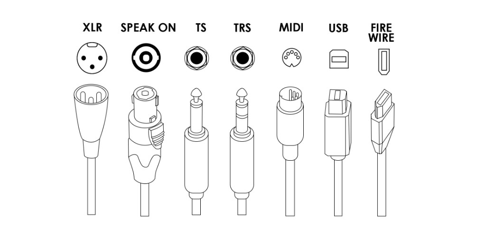
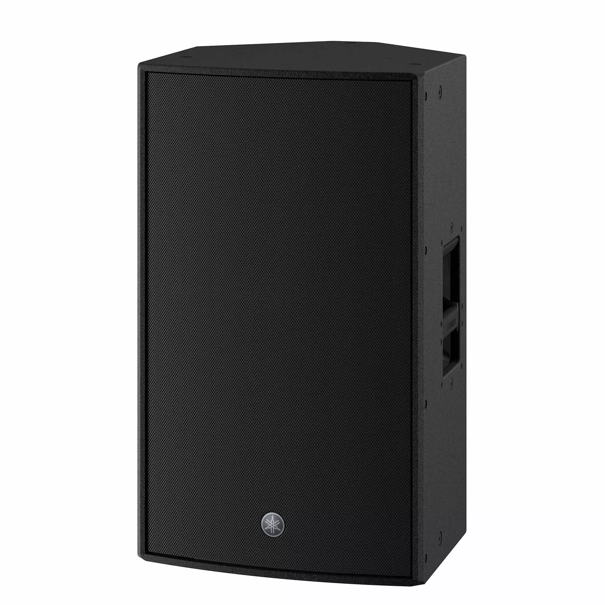
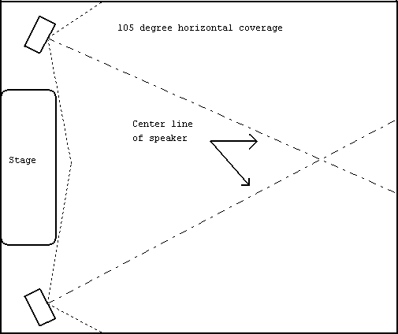
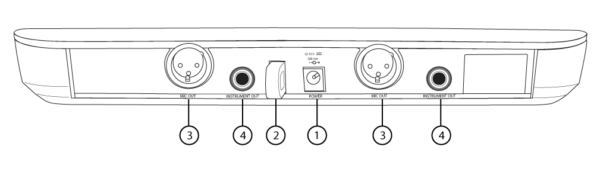
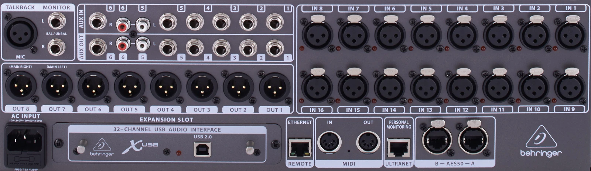
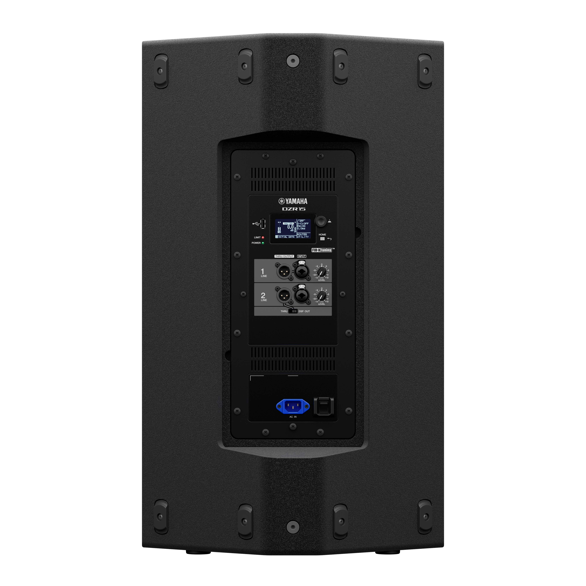

## Overview

- Understand the basic **signal flow**
- Learn what each hardware device does
- Learn how to place and connect the system
- Avoid common beginner mistakes

## 1. Understanding Signal Flow

Every section of the system has an **input** and an **output**.

**Basic path**

`Microphone -> Mixer -> Speaker`

**Why this matters**

- Troubleshooting gets easier
- You can check one stage at a time
- You understand what each device is responsible for

## 2. Microphone

Microphones are the **first step** in the chain.

- They turn sound in the air into an electrical signal
- Choice of mic affects tone, sensitivity, and feedback risk
- In live sound, **dynamic microphones** are the most common general-purpose choice
- **Condenser microphones** are often used for instruments or for capturing a wider sound such as choir, orchestra, or room ambience

## Dynamic vs condenser

- **Dynamic microphones** are usually tougher and more common for live vocals
- **Condenser microphones** are more sensitive and are often used when more detail is needed

{width="88%" fig-align="center" fig-alt="Comparison image showing a dynamic microphone and a condenser microphone"}

## When do we use which? {.compact-table}

| Situation | Better first choice | Why |
|---|---|---|
| **Live vocal on stage** | **Dynamic** | Rugged, reliable, and easier to control in a loud room |
| **Speech or general stage use** | **Dynamic** | Works well for most everyday PA situations |
| **Instrument miking** | **Condenser** | Captures more detail and high-frequency information |
| **Choir, orchestra, or room pickup** | **Condenser** | Better for capturing a wider and more detailed sound |

## Polar patterns — brief introduction

- **Cardioid**: hears mostly from the front
- **Omnidirectional**: hears from all directions

**Why we care**

- Pattern affects bleed and feedback
- Cardioid is the most common live vocal choice

## Polar patterns — examples

::: {.columns}
::: {.column width="54%"}
{width="100%" fig-align="center" fig-alt="Two polar diagrams showing omnidirectional and cardioid microphone pickup patterns"}
:::

::: {.column width="46%"}
{width="74%" fig-align="center" fig-alt="Supercardioid microphone polar pattern diagram"}

- **Omnidirectional** picks up sound from almost every direction
- **Cardioid** focuses on the front and rejects more from the rear
- **Supercardioid** is even tighter in front, but has a small rear pickup
:::
:::

## Feedback (howling)

- The speaker sends sound into the room
- The microphone picks that speaker sound up again
- The signal goes back through the mixer and speaker
- The loop repeats and builds into a howl

**Common causes**

- Mic is too close to a speaker or monitor
- Gain is too high
- Too many open mics

## Feedback — what to fix first

{width="62%" fig-align="center" fig-alt="Feedback loop diagram showing sound returning from the speaker to the microphone"}

- Change **placement** first
- Lower **gain** if needed
- Ring out problem frequencies only after placement is reasonable

## 3. Cables and connectors

::: {.columns}
::: {.column width="54%"}
Connectors matter because they tell us **what kind of signal** we are carrying and **what it should plug into**.

- The connector often tells you what kind of job that cable is doing
- Learning the common connector shapes saves time during setup and troubleshooting
:::

::: {.column width="46%"}
{width="100%" fig-align="center" fig-alt="Reference image showing XLR, TRS, and TS connectors"}
:::
:::

## Common connectors

- **XLR**: most common for microphones and pro audio
- **TS**: common for instruments and some unbalanced signals
- **EtherCON**: rugged locking network connector used for digital audio / control

**What to remember**
- XLR is the one you will use constantly

## Cable management

- Learn **over-under** wrapping
- Do not twist cables into tight loops
- Label important cables
- Keep signal cables tidy so faults are easier to find

**Quick demo**

[Over-under cable wrap short](https://www.youtube.com/shorts/ZW_Bh-6E7Go)

## 4. Mixer

The mixer is the **control center** of the system.

- Combines signals from microphones and other sources
- Adjusts level and tone
- Routes signals to mains, monitors, recording, and other destinations

**Our example mixer:** **Behringer X32**

## FOH and mixer placement

**FOH** means **Front of House**.

- This is the position where the engineer listens from the audience area
- FOH is usually the best place to judge what the audience is hearing
- In smaller setups, the mixer may also be at the side of the stage

## Channel strip basics

On a typical input channel:

1. **Gain**: sets input sensitivity
2. **EQ**: shapes the tone
3. **Fader**: sets how much of the channel goes to the main mix
4. **Aux send**: sends part of the signal somewhere else

**Important idea:** gain and fader are not the same thing.

## Monitor mix (Aux Send)

- A monitor mix lets performers hear what they need on stage
- This is often sent from an **aux**
- The monitor mix does **not** have to match the main house mix

**Example**

- Vocalist may want more vocal
- Drummer may want more click or keys

**Reference video:** [Monitor mix example](https://www.youtube.com/watch?v=q-Cr6WFmSDE&list=RDq-Cr6WFmSDE&start_radio=1)

## Phantom power (+48 V)

- Many condenser mics need **+48 V phantom power**
- Many dynamic mics do **not** need it
- Turn it on only for channels that require it

**Example:** a condenser like an **AT4040** needs phantom power.

## 5. Speakers and amplifiers

::: {.columns}
::: {.column width="50%"}
- **Main speakers** cover the audience
- **Monitor speakers** help performers hear on stage
- **Subwoofers** handle low frequencies
::: 

::: {.column width="50%"}
{width="100%" fig-align="center" fig-alt="Example of system"}
:::
:::

## Speaker placement
- Place the speakers so they project directly toward the **audience**
- Keep the speakers **in front of the microphones** to help prevent feedback
- In our setup, we usually place the **main speakers** on the left and right sides of the stage
- Angle them slightly inward, about **15 to 30 degrees**, so they cover the audience more evenly

**Simple goal:** clear coverage for the audience without causing feedback.

## Speaker placement - example

{width="100%" fig-align="center" fig-alt=""}

## 6. Try a real setup

**Goal:** connect a **Shure BLX88 receiver** to the **X32**, then send the mixer output to a **Yamaha DZR15**.

**Signal path**

`BLX88 -> X32 -> DZR15`

## Mic — BLX88 receiver

{width="100%" fig-alt="Rear panel of a Shure BLX88 receiver showing XLR outputs and quarter-inch outputs"}

- Use the **XLR OUT** on the BLX88 rear panel
- Connect that to an **XLR input** on the X32 mixer

## Mixer — X32 rear panel

{width="100%" fig-alt="Rear panel of a Behringer X32 mixer showing XLR inputs and outputs"}

- The **BLX88 output** goes into an **X32 XLR input**
- Use an **XLR cable** from the **X32 output** to the speaker input
- If you are using two main speakers, send **Main L** to the left speaker and **Main R** to the right speaker

## Speaker — DZR15 rear panel

::: {.columns}
::: {.column width="48%"}
{width="100%" fig-alt="Rear panel of a Yamaha DZR15 powered speaker"}
:::

::: {.column width="52%"}
- On the back of the **DZR15**, look for **INPUT 1** or another line input you are using
- Connect the **X32 output** to that **input**
- Because the **DZR15 is a powered speaker**, it does **not** need a separate external amp between the mixer and the speaker
:::
:::

## Summary

1. Learn the chain: **microphone -> mixer -> speaker**
2. Know the job of each device
3. Learn the difference between **dynamic** and **condenser**
4. Learn the common connectors: **XLR, TS, EtherCON**
5. Understand the basic mixer controls: **gain, EQ, fader, aux**
6. Place speakers for coverage, not chaos
